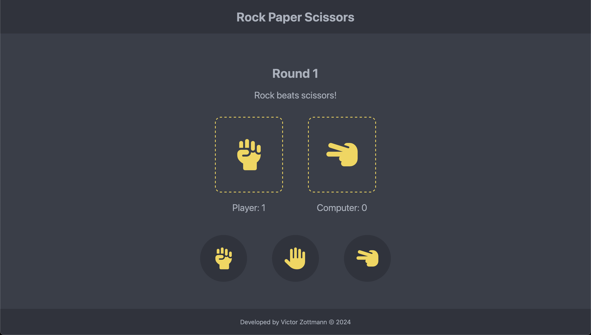

# Rock Paper Scissors

## Overview
Click here to see it live: [https://victorzottmann.github.io/rock-paper-scissors/](https://victorzottmann.github.io/rock-paper-scissors/)

This project is based on the Rock Paper Scissors game, where the player competes against the computer by choosing one of three options: `rock`, `paper`, or `scissors`. 

The winner of each round is determined based on the rules of the game:
- Rock beats scissors
- Scissors beat paper
- Paper beats rock

## Features
1. Player vs. Computer Gameplay: The player can make a choice between rock, paper, or scissors, and the computer makes a random choice.

2. Score Tracking: The game keeps track of the player's score and the computer's score throughout the game.

3. Round Management: The game consists of a total of 5 rounds, with the winner of each round earning a point. At the end of each round, a the game displayes a message indicating the outcome of the round (e.g. Rock beats scissors).

4. Game Over Status: After the game ends, a message is displayed indicating whether the player won, lost, or tied the game.

## How to Play
1. Click the `Start Game` button to begin.

2. Click on one of the buttons (`rock`, `paper`, or `scissors`) to make your choice. The computer will randomly select its choice.

3. Once you reach the 5th round, the game will end, and a game over message will be displayed.

4. To restart the game, click on the `Play Again` button after the game ends.

## Code Structure

- `index.html`: Contains the structure of the game layout and user interface elements.
- `style.css`: Defines the styles and appearance of the game.
- `script.js`: Implements the game logic and functionality using JavaScript.
- `data.js`: Stores the outcomes of each possible combination of player and computer choices.
- `README.md`: Documentation file containing information about the game.
